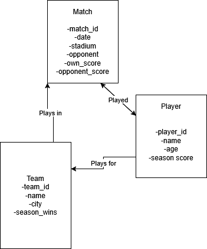

## Question 1: Weak vs Strong Entity Sets

A strong entity set is an entity that can be uniquely identified by its own attributes and exists independently in a database. A weak entity set, by contrast, cannot be uniquely identified on its own and depends on a strong entity — known as the identifying entity — for both its existence and identity.

**Example:** Consider a university course database. A course such as EPPS 6354 is a strong entity — it exists independently and can be uniquely identified by its own course code. It encapsulates all information about the course including its name, credits, and department.

A course section, however — such as EPPS 6354, Section 2, Spring 2026 — is a weak entity. "Section 2" alone has no meaning or identity without knowing which course it belongs to. It cannot exist in the database if the parent course EPPS 6354 does not exist. The section's identity is therefore entirely dependent on the strong entity (the course) that it is associated with.

## Question 2: E-R Diagram for Sports Team Scoring Statistics

### Part A: Single Team

The E-R diagram tracks the scoring statistics of a single sports team and consists of the following entities and relationships:

**Entities:**

-   **Player** — represents each player on the team. Attributes include `player_id` (primary key), `name`, and `age`. The derived attribute `season_score()` is computed by summing the individual `score` values associated with the player across all matches via the `played` relationship.

-   **Match** — represents each match played by the team. Attributes include `match_id` (primary key), `date`, `stadium`, `opponent`, `own_score`, and `opp_score`.

**Relationship:**

-   **Played** — a many-to-many relationship connecting Player to Match, representing which players participated in which matches. It carries the attribute `score`, which records the individual player's scoring contribution in that specific match.

**Derived Attribute:**

-   `season_score()` on the Player entity is derived by summing all `score` values linked to that player through the `played` relationship across all matches in the season.

### Part B: Expanded to All Teams in the League

To expand the diagram to track all teams in the league, a **Team** entity is added:

**Additional Entity:**

-   **Team** — represents each team in the league. Attributes include `team_id` (primary key), `team_name`, and `city`. The derived attribute `season_wins()` is computed by counting all matches where `own_score` is greater than `opp_score`.

**Additional Relationships:**

-   **plays_for** — a many-to-one relationship connecting Player to Team, indicating which team each player belongs to.

-   **plays_in** — a many-to-many relationship connecting Team to Match, indicating which teams participated in each match.

This expansion allows the database to track statistics not just for one team but for every team and player across the entire league.

\
