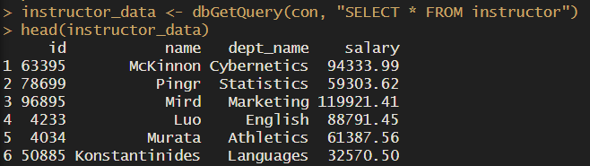
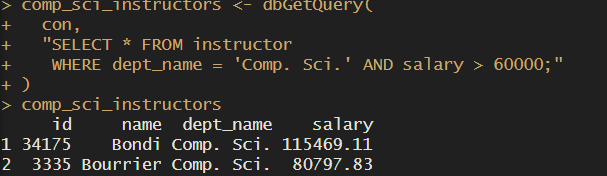
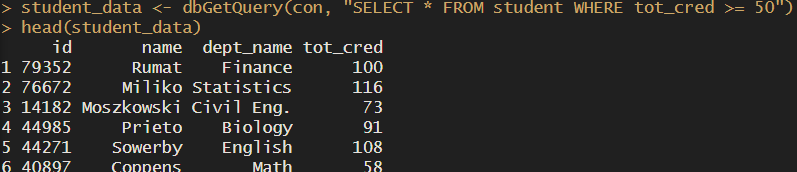

## Question 1: JSON and XML Data Representations

### Part A: JSON — Reddit (reddit.com)

Reddit's API serves all of its data in JSON format, accessible by adding .json to any Reddit URL (e.g., reddit.com/r/economics.json). The structure consists of nested key-value pairs where each object represents a data entity such as a post, comment, or user. Data is organized hierarchically — a subreddit response contains a data object, which contains a children array, with each child representing an individual post and its attributes like title, score, author, and URL. Reddit's technology stack uses REST APIs with React.js on the frontend to parse and dynamically render this JSON data into the familiar Reddit interface users see.

### Part B: XML — Reddit RSS Feed (reddit.com/r/subreddit.rss)

Reddit also publishes subreddit content as XML-based RSS feeds, accessible by adding .rss to any subreddit URL (e.g., reddit.com/r/economics.rss). Each post is wrapped in item tags containing child elements like title, link, description, and pubDate. The structure is self-describing — each tag explicitly labels what the data represents. RSS feed readers and browsers parse this XML to display news and content updates. XML is used here because RSS is a long-established standard for content syndication that predates JSON's rise in popularity.

### Comparison

Both formats represent the same Reddit data but in different ways. JSON is more compact, easier to parse in modern web applications, and maps directly to JavaScript objects. XML is more verbose but better suited for content syndication and is supported by a wider range of legacy feed readers and platforms.

------------------------------------------------------------------------

## Question 2: SQL Exercises

### Query i — Students with no advisor (using LEFT OUTER JOIN)

``` sql
SELECT student.ID
FROM student LEFT OUTER JOIN advisor ON student.ID = advisor.s_ID
WHERE advisor.i_ID IS NULL
```

### Query ii — Instructors who teach every course in their department

``` sql
SELECT DISTINCT i.ID, i.name
FROM instructor AS i
WHERE NOT EXISTS (
    SELECT course_id FROM course
    WHERE dept_name = i.dept_name
    AND NOT EXISTS (
        SELECT course_id FROM teaches
        WHERE teaches.ID = i.ID
        AND teaches.course_id = course.course_id
    )
)
ORDER BY i.name
```

------------------------------------------------------------------------

## Question 3: R and PostgreSQL

### Setup

The university database was imported into PostgreSQL using the large relations SQL file from the textbook website. The following R packages were used to connect and query the database: DBI, RPostgres, and odbc.

### Results

``` r
library(RPostgres)
library(DBI)

con <- dbConnect(
  RPostgres::Postgres(),
  dbname   = "university",
  host     = "localhost",
  port     = 5432,
  user     = "postgres",
  password = "yourpassword"
)

# Query 1: All instructors
instructor_data <- dbGetQuery(con, "SELECT * FROM instructor")
head(instructor_data)

# Query 2: Comp. Sci. instructors with salary over 60,000
comp_sci <- dbGetQuery(con,
  "SELECT * FROM instructor
   WHERE dept_name = 'Comp. Sci.' AND salary > 60000")

# Query 3: Students with more than 50 credits
students <- dbGetQuery(con,
  "SELECT * FROM student WHERE tot_cred >= 50")

dbDisconnect(con)
```

### Screenshots






