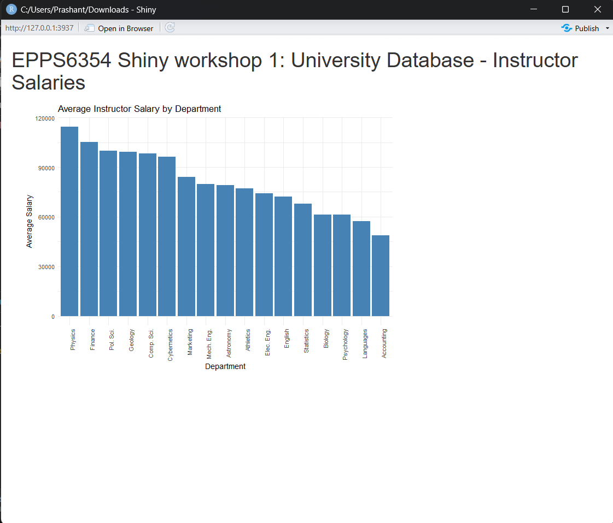
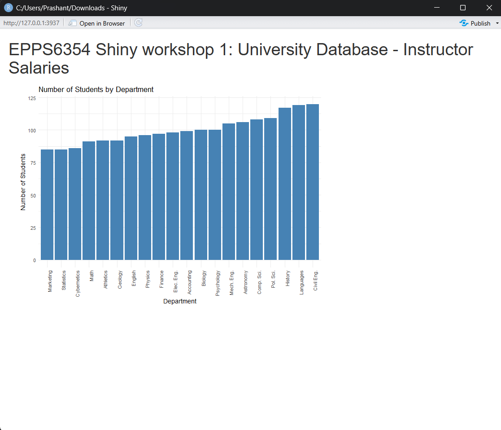

## Part 1: University Database — Instructor Salaries

### 1a & 1b: Connected to PostgreSQL and Sorted Salary High to Low

The app connects to a local PostgreSQL university database and displays average instructor salaries by department, sorted from highest to lowest.

### 1c: Alternative Variable — Number of Students by Department

Modified the SQL query to pull student count data from the student table instead of salary data from the instructor table.

------------------------------------------------------------------------

## Part 2: Old Faithful Geyser Data — Color Change

Modified the bar chart color from the default gray to mediumpurple.

