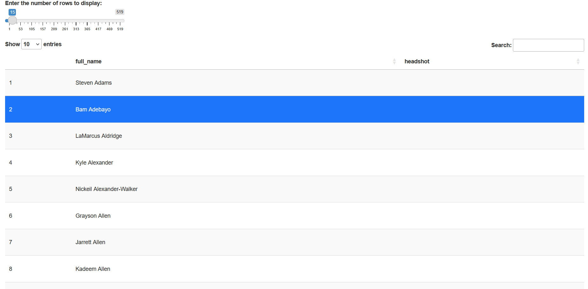

## Overview

This assignment involved building an NBA player database Shiny application following a multi-step workflow:

1.  Imported the NBA database from SQL file using DB Browser for SQLite
2.  Connected the SQLite database to R Shiny
3.  Built an interactive app allowing users to browse active NBA players with photos using a slider to control the number of rows displayed
4.  Deployed the app to shinyapps.io

## Live App

[Click here to view the NBA Database Shiny App](https://prashanttiwari.shinyapps.io/nba-app/)

## Screenshot

